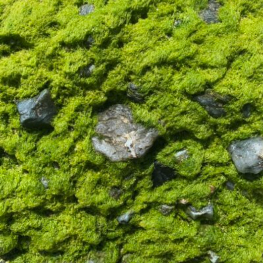
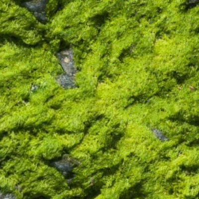

# Non-Parametric Texture Synthesis

|||
|:-:|:-:|
|Source image|Synthesized output image|

We implemented a method of non-parametric texture synthesis which is able to reproduce the patterns of a source image in a new randomly generated image. Our goal was to scale this technique up on large color images with more nuanced patterns, taken from real world images. We found that this method is surprisingly effective on simple real world texture images in most cases, capturing and reproducing the patterns of simple examples. However, some cases required us to tune the parameters to effectively capture the patterns.

This work is a reproduction of Efros and Leung's 1999 paper [Texture Synthesis by Non-parametric Sampling](Texture_synthesis_by_non-parametric_sampling.pdf).

Example output images from each of the textures we have can be found in the `synthesized` folder. These were taken with a size of 400x400, a window size of 15x15 and an epsilon of 0.0001.

## How to run

Install the necessary dependencies:

```
pip install -r requirements.txt
```

Execute the script like so:

```
python tex_synth.py textures/1.png test_out.png --resolution 50 50 --use-gpu
```

*It is highly recommended to use a GPU to get resonably good looking results*

## Full command line options

```
usage: python tex_synth.py [-h] -r height width [-w size] [-s size] [-e eps] [-d std] [-g] in_image out_image

Performs texture synthesis by non-parametric sampling. Generates a new image from a source image by replicating the observed patterns.

positional arguments:
  in_image              path to source image
  out_image             path to save synthesized output image to

options:
  -h, --help            show this help message and exit
  -r height width, --resolution height width
                        resolution of output image
  -w size, --window-size size
                        size of square sampling window taken over input image
  -s size, --seed-patch-size size
                        size of starting point patch, sampled from input image
  -e eps, --epsilon eps
                        distance threshold from closest window to sample other windows from
  -d std, --gaussian-std std
                        gaussian standard deviation for centered window distance weighting
  -g, --use-gpu         enable GPU usage by PyTorch
```
